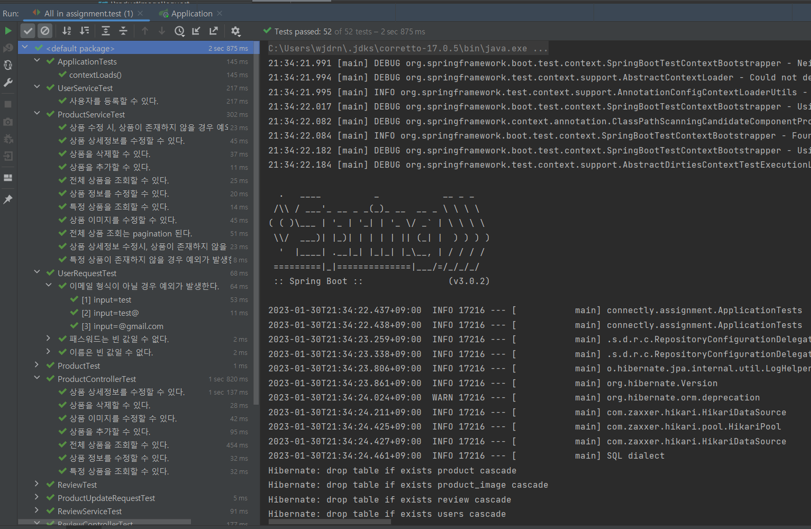

# 상품 조회 API 

## 환경 구성
- 코드 다운로드 후 별도의 DB나 Docker 구동 없이 실행되도록 h2 in-memory DB를 사용했습니다.
- Spring Boot (3.0.2) + Java 17
- Spring Boot 3.x에선 Java 17버전이 필요합니다. 인텔리제이로 구동하려면 설정을 Java 17로 수정해야 합니다.
  - 참고자료. [인텔리제이 Java 17 버전 구성](https://medium.com/sjk5766/spring-boot-%EB%B2%84%EC%A0%84%EC%97%90-%EB%94%B0%EB%A5%B8-java-%EB%B2%84%EC%A0%84-ff15c5ba7ecb)

## 엔티티 설명
- 크게 3개의 엔티티로 구성됩니다. (Product, Review, User)
- Product: 프로젝트의 메인인 상품 엔티티입니다.
- Review: 각 상품에 대한 Review 엔티티입니다.
- User: Review 때문에 추가했습니다. 간단한 컬럼들로 엔티티를 구성했습니다

## API 기능 설명
```
- product API 
  - 조회
    - GET /products   (전체 조회)
    - GET /products/1 (특정 상품 조회)
  - 상품 추가
    - POST /products
  - 상품 수정 
    - PATCH /products/1        (상품 수정)
    - PATCH /products/1/detail (상품 상세정보 수정)
    - PATCH /products/1/images (상품 이미지 수정)
  - 상품 삭제
    - DELETE /products/1
- user API
  - POST /users (유저 등록)
- review API 
  - 조회
    - GET /reviews?productId=1
  - 추가
    - POST /reviews
  - 수정
    - PATCH /reviews/1
  - 삭제
    - DELETE /reviews/1
```

## 디렉토리 구조
```text
src
 |--- main
    |--- common
    |  |--- BaseEntity.js (엔티티에 공통으로 적용되는 컬럼)
    |  |--- PageResponse.js (페이지네이션 응답 파일)
    |  |--- ResponseMessage.js (API 응답에 사용되는 공통 포맷)
    |--- product
    |  |--- domain 패키지 (엔티티 + enum)
    |  |--- dto 패키지 (request, response dto 구성)
    |  |--- repository 패키지(둘 이상일때 따로 repository 패키지로 구성, 하나면 파일로 둠)
    |  |--- ProductController.java
    |  |--- ProductService.java
    |--- review (product와 동일)
    |--- user (product와 동일)
    |--- Application.java
 |--- test
    |--- fixture 패키지 (테스트에 필요한 엔티티, dto를 생성하는 헬퍼 함수)
    |--- product 패키지
      |-- domain 패키지 (domain 테스트 함수)
      |-- dto 패키지 (dto 테스트 함수)
      |-- ProductControllerTest.js
      |-- ProductServiceTest.js
    |--- review (위 product 패키지와 동일)
    |--- user (위 user 패키지와 동일)
```

## 테스트 결과 


## 시간이 더 있었다면 과제에 반영했을 기능들
- 에러 발생시 ExceptionHandler를 사용하여 공통 응답이 가도록 수정
- 상품에 대한 카테고리 적용 (신상, 남성, 여성 등의 카테고리)
- 상품 조회에 대한 order by (최신순, 할인 순)

## 과제 수행 기간
- 과제 받을 때 제출 기한은 따로 없으나 채용이 마감이 될 수 있다고 적혀 있었습니다.
- 시간이 제일 중요한 것 같아 4일 (금, 토, 일, 월) 동안 과제를 수행했습니다.
